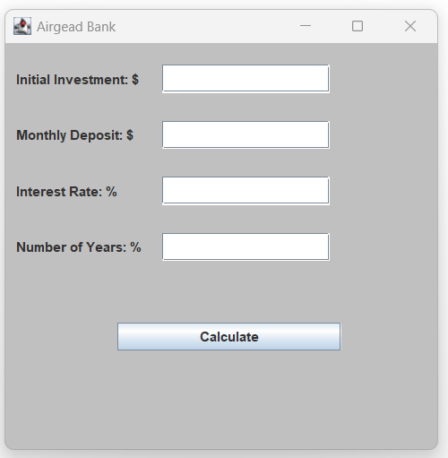
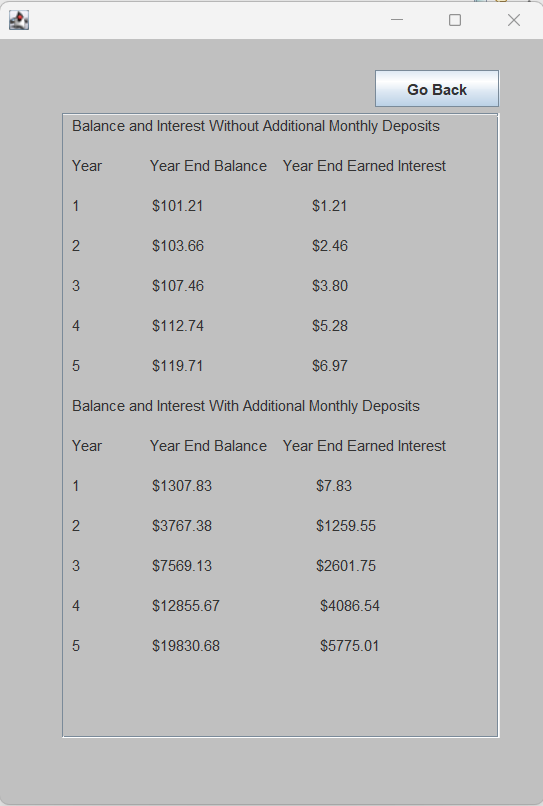

# 
Computer Science Capstone 2023

# ePortfolio

## Welcome

Welcome to my ePortfolio. My name is Isabel Rodarte; I am pursuing a bachelor's degree in computer science from Southern New Hampshire University. The main objective of creating my ePortfolio is to showcase my abilities, strengths, and knowledge in computer science. The ePortfolio will showcase three artifacts that have been enhanced per category: software design/engineering, algorithms and data structures, and databases. The enhancement per category will take the original artifact and improve it based on course outcomes.

### Code Review

Code review will consist of four significant areas of code: consistency in formatting/ overall design, quality documentation, and consistency of coding standards and project requirements. Checking within the four major areas adds quality assurance to the developed software. Code review is an essential practice for computer science professionals because it allows computer scientists to build reliable code free of errors, bugs, and issues that could hinder a project. 

##### Click for code review [Airgead Banking App Part One](https://youtu.be/2HvVSMEsoPc)
##### Click for code review [Airgead Banking App Part Two](https://youtu.be/YlSjaP9tfO0)
##### Click for code review [Appointment Service](https://youtu.be/aUXfJsRixOU)

### Artifact One: Software Engineering and Desgin
#### Airgead Banking App

The Airgead Banking C++ application is a financial calculator that asses financial investments with and without deposits. This will demonstrate skills used throughout computer science and logical and critical thinking.

  

##### Click to review project [Airgead Banking App](https://github.com/isabelrodarte87/CS-499_ePortfolio/tree/Airgead-Bank-App?tab=readme-ov-file#enhancement-one-software-designengineering)

### Artifact Two: Algorithms and Data Structures
#### Airgead Banking App

The Airgead Banking App uses loops to calculate mathematical input and outputs in Java. It will demonstrate my ability to enhance an algorithm to improve efficiency by applying the calculation formula Math.pow and showcasing evaluating computing solutions and solving a mathematical problem using algorithmic principles.

  

##### Click to review project [Airgead Bank App](https://github.com/isabelrodarte87/CS-499_ePortfolio/tree/AirgeadBankAlgorithm?tab=readme-ov-file#enhancement-two-algorithms-and-data-structures)

### Artifact Three: Databases
#### Appointment Services

The Appointment Service holds clients' information such as appointment date, description, and ID. It will display my knowledge of databases, implementation within a project, and the use of well-founded tools to incorporate the database.

##### Click to review project [Appointment Services](https://github.com/isabelrodarte87/CS-499_ePortfolio/tree/AppointmentServices?tab=readme-ov-file#enhancement-three-databases)

## Professional Self-Assesment

During my computer science journey, I gained valuable skills and learned more in-depth computer science concepts. Some of which are essential and helpful in setting professional goals. 

Course CS-260, Data Structures and Algorithms introduces the importance of data structures and algorithms as they are essential for a program to function. I gained knowledge of the importance of data structures, and without a data structure, it would be challenging to write code, maintain the code, and debug. Data structures reduce redundancy in coding, which is a crucial tool within software development. The value of this course ensures my ability to sort, manage, and store information along with efficient techniques to accomplish any operation on data.

Throughout my coursework in CS-310 Collaborating and Team Projects, I was introduced to git. Before this course, I was unfamiliar with git and its purpose. However, I have learned that git is essential in a collaborating team environment. It allows a git repository to be uploaded openly, which peers can collaborate on. Also, version control is beneficial as it tracks modifications made to the code among peers and reverses mistakes by comparing earlier code versions.

Other courses throughout my computer science program also help shape values in professional goals. I discovered the value of communication in every concept and category of computer science. For example, during CS-320 Software Test Automation & QA, the value of communicating with stakeholders in the SDLC process is essential. It builds trust, rapport, and collaboration with stakeholders. Communicating with stakeholders encourages valuable feedback, requirements, resources, and support. CS-340 Client Server Development, introduce me to MongoDB. During this course, I was required to connect MongoDB, demonstrating comprehension of programming, including adding safety features for enhancing security with the user by adding a username and password along with user permissions.

Nevertheless, my individual growth was displayed in every computer science course. I will continuously apply the knowledge gained and outlined in my ePortfolio and showcase my overall skills, techniques, and understanding of computer science.

## Course Outcomes

#### Course Outcome 1

I Employed strategies for building collaborative environments that enable diverse audiences to support organizational decision-making in computer science by completing the following code review. In computer science, code review is essential to the overall project quality. It provides feedback on areas of improvement within the code, leading to proper decision-making. The Airgead Banking App enhancement was designed for a collaborative environment due to the GUI that makes it user-friendly and accessible to everyone, even those who may not have a software development background.

#### Course Outcome 2
I Designed, Developed, and Delivered professional-quality oral, written, and visual communications that are coherent, technically sound, and appropriately adapted to specific audiences and contexts by completing the following enhancement in artifact Airgead Banking App. The Airgead Banking App was developed for clients' usage from a business perspective. I encouraged the front-end design using GUI and applied oral, written, and visual communication based on business professionalism. I was providing an exceptional experience for all users and the Airgead Banking Business.

#### Course Outcome 3
I Designed and Evaluated computing solutions that solve a given problem using algorithmic principles and computer science practices and standards appropriate to its solution while managing the trade-offs involved in design choices by completing the following enhancement by converting the mathematical loop into a mathematical formula by applying the Math.pow. This provides more efficiency in multiplying large numbers, which calculates compound interest in the Airgead Banking App. The design was updated to a user-friendly window that displays appropriate labels, text field boxes, and buttons by managing the design choices' trade-offs.

#### Course Outcome 4
I Demonstrated an ability to use well-founded and innovative techniques, skills, and tools in computing practices to implement computer solutions that deliver value and accomplish industry-specific goals by completing the following enhancements of language migration from C++ to Java and implementing GUI in Airgead Banking App and developing a database for Appointment Service. The language migration demonstrated skills and techniques like logical thinking, critical thinking, and code readability. The language migration to Java creates a versatile application for different platforms. Improvements to the design by using GUI to create a user-friendly window apply critical thinking, and with the labels, text boxes, and buttons, expected results were output when the application was running. Appointment Service database was developed in MySQL Workbench, a computer science tool used to create a database with tables containing data pulled by the Java application for creating, reading, updating, and deleting an appointment demonstrating my ability in the use of well-founded tools and techniques.

#### Course Outcome 5
I Developed a security mindset that anticipates adversarial exploits in software architecture and designs to expose potential vulnerabilities, mitigate design flaws, and ensure privacy and enhanced security of data and resources by completing the following enhancements: developing a database in MySQL Workbench for Appointment Services. MySQL Workbench is on a local system, which reduces the possible threats of cloud-based databases on the internet that can be exposed to a breach, ensuring a security mindset and exposure to potential vulnerabilities. A username and password are created for the local host to grant access when the Appointment Service connects to the MySQL database. If the user and password are incorrect, it produces an error message, not giving access and securing the database.

